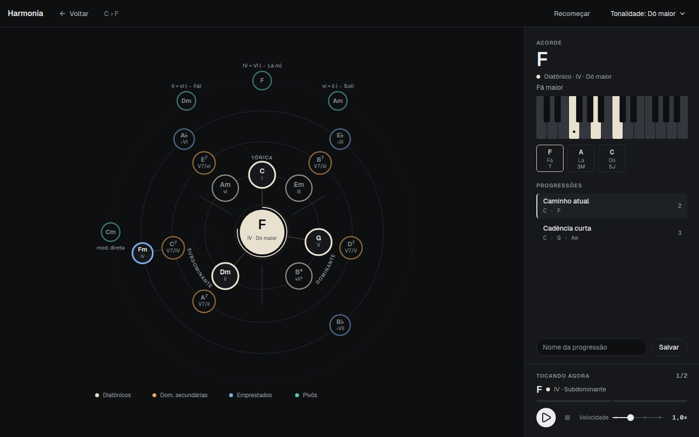

# Harmonia

**Navegador harmônico interativo para o navegador.** Escolha um acorde, ouça no piano e veja, em anéis ao redor dele, para onde a harmonia pode ir: funções do tom, dominantes secundárias, empréstimos modais e acordes que levam a outros tons. Cada clique transforma o acorde escolhido no novo centro.



A interface é em português (Brasil). Não há login nem servidor: tudo roda no navegador, e as progressões salvas ficam no `localStorage`.

## Funcionalidades

- **Mapa de continuações.** Os acordes possíveis aparecem em quatro anéis em volta do acorde central, cada anel com uma cor:
  - **Diatônicos** (marfim): tônica, subdominante e dominante do tom atual.
  - **Dominantes secundárias** (âmbar): o V7 de cada grau, posicionado no ângulo do acorde que ele prepara.
  - **Empréstimos modais** (azul): acordes do modo paralelo, como iv, ♭III, ♭VI e ♭VII no tom maior.
  - **Pivôs** (verde-sálvia): acordes-porta para o relativo, o paralelo e os tons vizinhos a uma quinta. Clicar em um deles muda o tom.
- **Som.** Cada acorde toca por cerca de 3 segundos. O seletor **Piano / Sintetizador**, na barra de cima, escolhe amostras de piano (Salamander) ou um sintetizador, e a escolha fica salva no navegador. Se as amostras ainda carregam ou falham, o sintetizador toca no lugar e a barra diz isso.
- **Teclado e notas.** O acorde escolhido aparece num teclado, com o nome e o intervalo de cada nota.
- **Sugestão de próximo passo.** Um traço mais forte liga o centro aos passos mais prováveis a partir da função do acorde atual. Passar o cursor sobre um acorde mostra a explicação.
- **Progressões.** O caminho percorrido fica na barra lateral. Dá para salvar, carregar e tocar progressões, com velocidade de 0,5× a 2,0×.
- **Grafia correta.** Os nomes seguem o tom: F♯ maior usa sustenidos (o vii° é E♯°), e dobrados como F𝄪 aparecem quando a teoria pede.

## Como rodar

Você precisa do [Node.js](https://nodejs.org) 22 ou mais recente.

```bash
git clone https://github.com/kendatta/harmonia.git
cd harmonia
npm install
npm run dev
```

Abra [http://localhost:4731](http://localhost:4731). O navegador só libera o áudio depois do primeiro clique na página.

### Outros comandos

```bash
npm test          # roda os testes da teoria, do layout, do estado e do áudio
npm run build     # gera o site estático em dist/
npm run preview   # serve o build localmente
npm run lint      # verifica o código com oxlint
```

O resultado de `npm run build` é um site estático e pode ser publicado em qualquer hospedagem estática, como Vercel, Netlify, Cloudflare Pages ou GitHub Pages.

## Como usar

1. Em **Recomeçar**, escolha a fundamental, a qualidade do acorde e a tonalidade. **Definir centro** começa um caminho novo a partir desse acorde.
2. Clique em qualquer acorde do mapa para ouvi-lo, ver as notas e torná-lo o novo centro. O mapa se reorganiza em volta dele.
3. **Voltar** desfaz o último passo.
4. Na barra lateral, **Tocar** percorre a progressão selecionada, **Salvar** guarda o caminho atual com um nome e **Carregar** traz uma progressão salva de volta para o mapa.

## Modelo harmônico

O tom de referência pode ser maior ou menor, e o mapa não gira: cada grau tem um ângulo fixo, com o I no topo, e três setores (tônica, dominante e subdominante) organizam as posições.

| Grupo | Anel | O que entra |
| --- | --- | --- |
| Diatônicos | 1 | Tônica (I, iii, vi ou i, III, VI), subdominante (ii, IV ou ii°, iv) e dominante (V, vii°). No menor, o V e o vii° vêm da escala menor harmônica. |
| Dominantes secundárias | 2 | V7 de cada grau maior ou menor, exceto a tônica e os diminutos. Exemplo: em Dó maior, o V7/V é D7. O tom não muda. |
| Empréstimos modais | 3 | No maior: iv, ♭III, ♭VI e ♭VII do menor natural paralelo. No menor: v e VII do modo natural, mais I e IV do maior paralelo. O tom não muda. |
| Pivôs | 4 | Acordes-porta para o relativo, o paralelo e os tons a uma quinta acima e abaixo. O clique troca o tom, e o rótulo mostra o destino, como "→ Sol". |

Quando o mesmo acorde aparece duas vezes, a diferença é o destino. Em Dó maior, **Am · vi** continua em Dó, enquanto **Am · relativo** passa a ser o i de Lá menor.

## Tecnologias

- [TypeScript](https://www.typescriptlang.org), [React](https://react.dev) e [Vite](https://vite.dev)
- [Tonal](https://github.com/tonaljs/tonal) para a teoria musical
- [Tone.js](https://tonejs.github.io) para o áudio: Sampler (Salamander) ou PolySynth, escolhidos no seletor Piano / Sintetizador
- SVG com [Motion](https://motion.dev) para o mapa e as animações
- [Zustand](https://github.com/pmndrs/zustand) para o estado, persistido em `localStorage`
- [Tailwind CSS](https://tailwindcss.com), fontes Geist e Geist Mono
- [Vitest](https://vitest.dev) para os testes

## Estrutura

```
src/
  theory/      teoria harmônica: acordes, continuações e layout do mapa
  components/  mapa, teclado, barra lateral e seletor de acordes
  audio/       piano (Tone.js)
  store/       estado da aplicação (Zustand)
  theme/       cores e tokens visuais
```

## Limitações

- O movimento diatônico usa tríades. Sétimas aparecem no acorde inicial, nas dominantes secundárias e na análise.
- Não há condução de vozes. O destaque do próximo passo é uma sugestão, não uma regra.
- As modulações cobrem o relativo, o paralelo e os tons a uma quinta de distância. Tons distantes, sexta napolitana e dominantes estendidas ainda não entram.
- O áudio usa temperamento igual e voicing fechado a partir de C3.
- As progressões salvas ficam só no navegador onde foram criadas.
